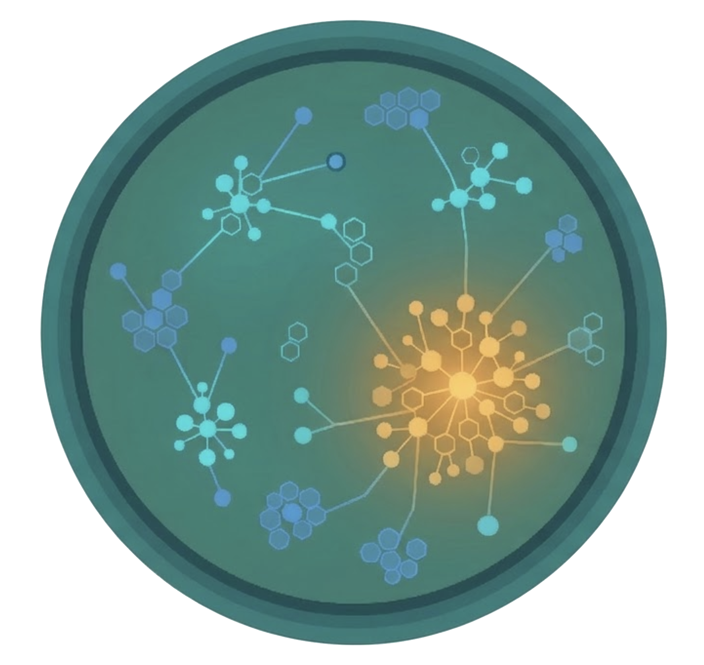

# Petri



Infrastructure lab framework for spawning ephemeral, realistic company infrastructures. Petri creates Kubernetes clusters, applications, IaC repositories, and observability stacks that mimic real production environments — for testing and development.

## Quick Start

### Prerequisites

- Go 1.21+
- Docker (for local labs)
- Git
- Cloud provider CLIs (aws, az, gcloud) and Terraform/Pulumi for cloud labs

### Install

```bash
git clone https://github.com/yourusername/petri.git
cd petri
go build -o petri cmd/petri/main.go
sudo mv petri /usr/local/bin/
petri init
```

### Create a Local Lab

```bash
petri create --company=acme --level=1 --local --name=my-first-lab
```

This creates a kind cluster with microservices, platform components (cert-manager, ingress-nginx), observability (Prometheus, Grafana), and git repos on the local filesystem.

```bash
petri info my-first-lab    # Show details and access instructions
petri list                 # List all labs
petri extend my-first-lab  # Extend TTL by 1 hour
petri destroy my-first-lab # Tear down everything
```

### OASIS Evaluation Server

```bash
petri create --company=acme --level=1 --local --oasis --name=eval-lab
petri serve --lab=eval-lab
```

The `--oasis` flag configures audit logging and Calico CNI (for NetworkPolicy enforcement). `petri serve` starts an HTTP server implementing the [OASIS evaluation spec](docs/oasis-spec/) for scenario-based testing of AI agents against live clusters.

## Commands

| Command | Description |
|---------|-------------|
| `petri init` | Initialize config, encryption key, and directories |
| `petri create` | Create a new lab (local or cloud) |
| `petri list` | List labs with optional filters |
| `petri info` | Show full lab details |
| `petri destroy` | Destroy a lab and all its resources |
| `petri extend` | Extend a lab's TTL |
| `petri cleanup` | Destroy expired labs |
| `petri export-creds` | Export encrypted credentials bundle |
| `petri health` | Check system health (binaries, config, keys) |
| `petri serve` | Start OASIS environment provider server |
| `petri completion` | Generate shell completions (bash/zsh/fish/powershell) |

See [docs/cli-reference.md](docs/cli-reference.md) for full flags and usage.

## Documentation

- [CLI Reference](docs/cli-reference.md) — all commands, flags, and defaults
- [Companies & Complexity Levels](docs/companies.md) — company profiles (acme, techflow, cloudnative) and level details
- [Configuration](docs/configuration.md) — config file, environment variables, credentials, cloud costs
- [Observability](docs/observability.md) — Prometheus metrics and structured logging
- [Troubleshooting](docs/troubleshooting.md) — common issues and fixes
- [Development](docs/development.md) — building from source, testing, adding companies
- [Architecture](docs/petri-architecture.md) — system design and internals
- [OASIS Spec](docs/oasis-spec/) — upstream evaluation specification

## License

Apache 2.0
